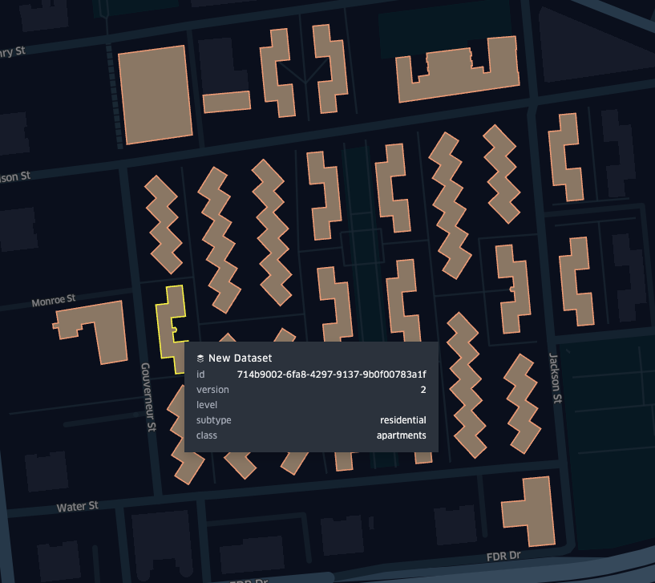
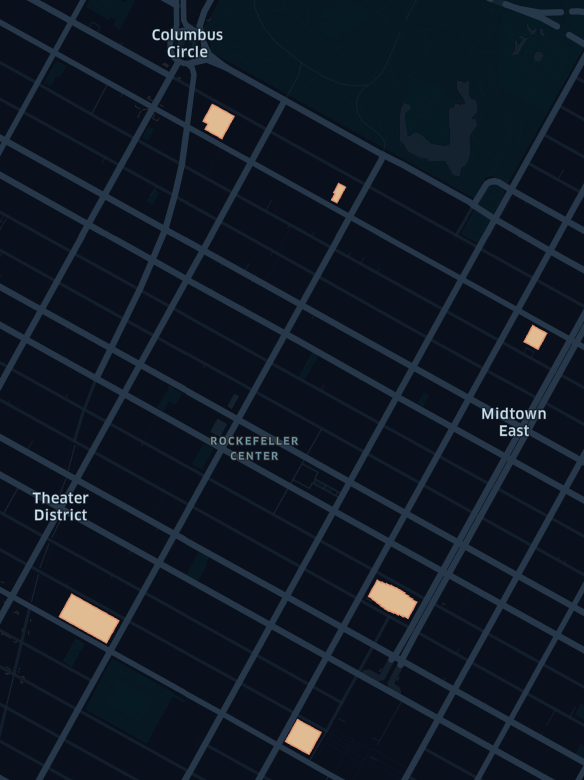

# `fast-geoparquet-features`

A simple GeoParquet feature + vector tile server built with FastAPI and DuckDB. Query, filter, and serve vector data straight from GeoParquet in object storage.

✨ Features

* 🚀 Serve GeoJSON from GeoParquet directly via HTTP requests
* ⚡ Fast queries with DuckDB (spatial extension enabled)
* 🗂️ Filter features by bounding box or CQL expressions
* 🌍 GeoJSON, GeoJSONSeq/ndjson, CSV, and GeoParquet output formats supported
* 🌐 Vector tiles (MVT/PBF) from GeoParquet on-the-fly
* 🐍 Modern Python stack with FastAPI + async streaming responses

> [!WARNING]
> This is a tech demo/prototype. Expect bugs and breaking changes.

## Setup

* `uv sync`
* `uv run fastapi dev`
* Open `http://localhost:8000/docs` in your browser to view the interactive Swagger docs

> [!TIP]
> If request errors occur when querying datasets in S3, try setting `AWS_REGION=<dataset-region>` in your environment.

## Examples

### Features API

Features are served from the `/features` endpoint. Here are some examples of querying Overture Foundation's Buildings dataset directly in S3.

* Bounding box filter:

    ```sh
    $ curl -X 'GET' \
    'http://localhost:8000/features?url=s3%3A%2F%2Foverturemaps-us-west-2%2Frelease%2F                                                   ││                                                                                                                            ││%2Ftheme%3Dbuildings%2Ftype%3Dbuilding%2F%2A&limit=100&bbox=-73.98407324497613,40.711304868311316,-73.98038796085099,40.713572466980054' | jq > data/demo.geojson
    ```

    * [Result](./data/demo.geojson)
        

* Bounding box and CQL2-Text filter (`height > 350`):

    ```sh
    $ curl -X 'GET' \
    'http://localhost:8000/features?url=s3%3A%2F%2Foverturemaps-us-west-2%2Frelease%2F2025-10-22.0%2Ftheme%3Dbuildings%2Ftype%3Dbuilding%2F%2A&filter=height%20%3E%20350&f=geojson&bbox=-73.99341797466995%2C40.75292045436345%2C-73.95647120320056%2C40.777695601276434' | jq > data/height-filter-demo.geojson
    ```

    * [Result](./data/height-filter-demo.geojson)

        

## Vector Tiles API

MVT/PBF vector tiles are served from the `/tiles/{z}/{x}/{y}` endpoint. A simple slippy map viewer is also available at the `/viewer` endpoint ([localhost example](http://localhost:8000/viewer?url=s3://overturemaps-us-west-2/release/2025-10-22.0/theme=buildings/type=building/part-00037-c5e0b5f2-08ff-4192-af19-c572ecc088f1-c000.zstd.parquet)).

> [!WARNING]
> Serving vector tiles from large, partitioned GeoParquet file(s) in object storage can be pretty slow. This is especially acute if the app is not running colocated to the data. For example, serving vector tiles from Overture's Building's dataset in AWS S3 `us-west-2` by running the app locally on the East Coast results in latency on the order of seconds to tens of seconds ([localhost example](http://localhost:8000/viewer?url=s3://overturemaps-us-west-2/release/2025-10-22.0/theme=buildings/type=building/*)). The initial tile request(s) can be especially slow because DuckDB scans and caches the Parquet metadata. For partitioned datasets this can require touching each file.
> Running locally with multiple workers (e.g., `uv run fastapi run --workers=4`) can improve performance by distributing request processing across threads.
>
>    

## Notes

* Bounding box filtering requires GeoParquet created with bbox/covering metadata as described in [the v1.1.0 spec](https://geoparquet.org/releases/v1.1.0/).
* Performance is best with [a spatially sorted GeoParquet](https://github.com/opengeospatial/geoparquet/blob/main/format-specs/distributing-geoparquet.md).
* Overture data are publicly available for [60 days](https://docs.overturemaps.org/blog/2025/09/24/release-notes/) from the date they are published. The URIs referring to Overture datasets used in the example links in this README may therefore become stale. Updating the date path to the latest release should resolve the issue (e.g., `2025-08-20.1` -> `2025-10-22.0`).

## Acknowledgements

This project was inspired by and benefits from some really cool open source projects including:

* [tipg](https://developmentseed.org/tipg/)
* [cql2-rs](https://developmentseed.org/cql2-rs/latest/)
* [duckdb](https://github.com/duckdb/duckdb)
* [duckdb spatial extension](https://github.com/duckdb/duckdb-spatial)
* [GeoParquet](https://github.com/opengeospatial/geoparquet)
